## 1 背景

目前在消息页面加一个新类型的消息成本巨大，至少需要在PlatformEnum加入新的message的Type，在MessageAdapter加入两个adapter的type：send & receive， 点击相关还需要加入一个viewTag的type，因此至少需要添加4个type，并且你还得注意和别人定义之间的冲突。除此之外各个类的职责不够清晰，MessageAdapter、MessageHandle、BaseChatPanel各个类相互混合了很多逻辑已经很难维护了。因此我们计划做一波重构设计，提高可维护性，为后续敏捷迭代打好基础

## 2 现状

MessageAdapter维护了一堆枚举

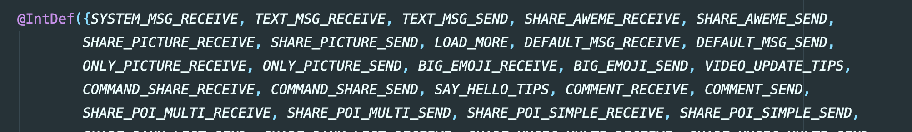
<!-- 图片：代码片段，背景为深色，使用 @IntDef({...}) 定义了一系列消息类型常量，如 SYSTEM_MSG_RECEIVE、TEXT_MSG_RECEIVE、TEXT_MSG_SEND、SHARE_AWEME_RECEIVE、SHARE_AWEME_SEND、SHARE_PICTURE_RECEIVE、SHARE_PICTURE_SEND、LOAD_MORE、DEFAULT_MSG_RECEIVE、DEFAULT_MSG_SEND、ONLY_PICTURE_RECEIVE、ONLY_PICTURE_SEND、BIG_EMOJI_RECEIVE、BIG_EMOJI_SEND、VIDEO_UPDATE_TIPS、COMMAND_SHARE_RECEIVE、COMMAND_SHARE_SEND、SAY_HELLO_TIPS、COMMENT_RECEIVE、COMMENT_SEND、SHARE_POI_MULTI_RECEIVE、SHARE_POI_MULTI_SEND、SHARE_POI_SIMPLE_RECEIVE、SHARE_POI_SIMPLE_SEND 等。 -->

MessageAdapter 定义了消息的点击事件，一堆if..else

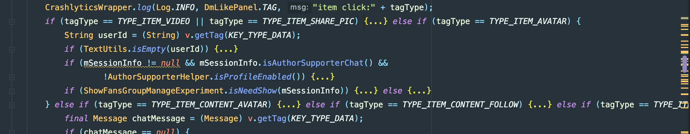
<!-- 图片：代码截图，CrashlyticsWrapper.log 日志输出后，基于 tagType 的多条件 if-else if 判断结构，涉及 TYPE_ITEM_VIDEO、TYPE_ITEM_SHARE_PIC、TYPE_ITEM_AVATAR 等常量；TYPE_ITEM_AVATAR 分支中有获取 userId、判断 userId 是否为空、检查 mSessionInfo 是否为 null 及调用 isAuthorSupporterChat、AuthorSupporterHelper.isProfileEnabled、ShowFansGroupManageExperiment.isNeedShow 的嵌套 if 判断；后续还有 TYPE_ITEM_CONTENT_AVATAR、TYPE_ITEM_CONTENT_FOLLOW 等分支。 -->

ViewHolderFactory 也是一堆switch

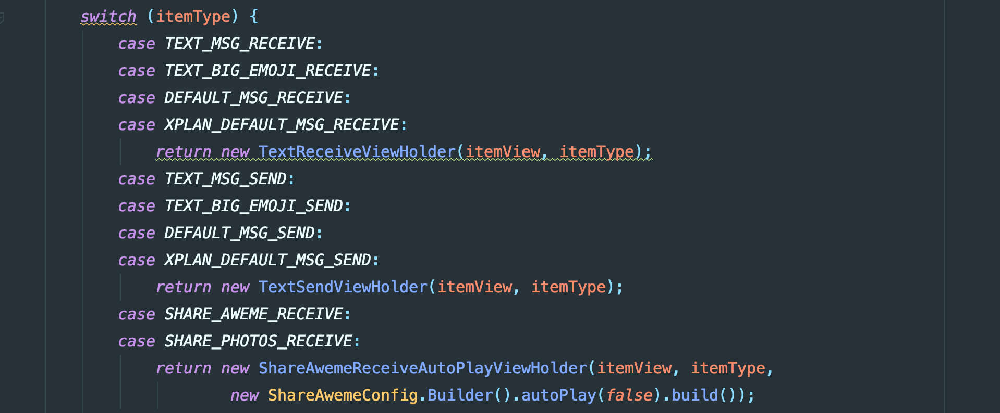
<!-- 图片：代码截图，一个 switch 语句，判断条件为 itemType。包含 TEXT_MSG_RECEIVE、TEXT_BIG_EMOJI_RECEIVE、DEFAULT_MSG_RECEIVE、XPLAN_DEFAULT_MSG_RECEIVE 共同返回 new TextReceiveViewHolder；TEXT_MSG_SEND、TEXT_BIG_EMOJI_SEND、DEFAULT_MSG_SEND、XPLAN_DEFAULT_MSG_SEND 共同返回 new TextSendViewHolder；SHARE_AWEME_RECEIVE 和 SHARE_PHOTOS_RECEIVE 共同返回 new ShareAwemeReceiveAutoPlayViewHolder。 -->

除此之外MessageViewType、LongClickListener、MessageLayoutHelp等都是大量的枚举逻辑，显然可维护性低，不符合开闭原则

## 3 分析

RecyclerView的思想核心是数据和ui一一绑定，通过adapter把数据适配成ui元素。根据代码设计可以总结为三种映射

1. 数据和ui-type映射，即 `int getItemViewType(int position)`，一般来说同种数据映射为一种type，不同数据对应不同type，目前实现为 (message <-> uiType) 的转换

```fortran
@Override
public int getItemViewType(int position) {
    if (position == 0 && ImHisMsgLoadMoreExperiment.getIS_OPEN()) {
        return LOAD_MORE;
    }
    Message chatMessage = mData.get(switchItemPos2DataPos(position));
    MessageViewType messageViewType = MessageViewType.valueOf(chatMessage);
    return messageViewType.getItemViewType();
}
```

2. ui-type和viewHolder映射， 即 `onCreateViewHolder`，这一步是RecyclerView的内部转换， 即给定一个type，创建出一个与之相关的holder，目前实现是 (uiType <-> ViewHolder) 的转换

```java
@Override
public BaseViewHolder onCreateViewHolder(@NonNull ViewGroup parent, @ItemType int viewType) {
    MessageViewType messageViewType = MessageViewType.valueOf(viewType);
    View itemView = LayoutInflater.from(context).inflate(messageViewType.getItemLayoutId(), parent, false);
    BaseViewHolder viewHolder = messageViewType.getViewHolder(itemView);
}
```

3. view和数据的映射， 即 `onBindViewHolder`，把数据填充到view中，目前实现是 (holder <-> message.content) 绑定

```typescript
@Override
public void onBindViewHolder(@NotNull BaseViewHolder holder, int position, @NonNull List<Object> payloads) {
    Message msg = mData.get(switchItemPos2DataPos(position));
    Message preMsg = getPreMessage(position);
    holder.bind(msg, preMsg, MessageViewType.content(msg), position, payloads);
```

因此， 可以解读为给定一个Message列表，对于每个Message能找到一个ui-type，进而能找到一个viewHolder来承载它，并且每个Message可以用其解析出来的content来填充前面的viewHolder。但是有几个问题：1. 每个Message如何找到ui-type？ 2. 每个Message如何找到layout？3. 每个Message如何解析自己content？

三个问题的核心就是下面这个枚举, 可以看到每一种消息类型都和一种layout布局和解析类产生了关联，因此每增加一个新类型，就需要加一个枚举，这个类的爆炸就成了个大问题

```typescript
public enum MessageViewType {
    ITEM_SYSTEM_RECEIVE(SYSTEM_MSG_RECEIVE) {
        @Override
        public int getItemLayoutId() {
            return R.layout.im_item_msg_system_receive;
        }

        @Override
        public Class<? extends BaseContent> getMessageContentClazz() {
            return SystemContent.class;
        }
    },
    ITEM_TEXT_RECEIVE(TEXT_MSG_RECEIVE) {
        @Override
        public int getItemLayoutContentId() {
            return R.layout.im_item_msg_text_content_receive;
        }

        @Override
        public Class<? extends BaseContent> getMessageContentClazz() {
            return TextContent.class;
        }
    },
 //  more......
```

## 4 Split

我们考虑做一个框架，希望能解决上面描述的问题，即加一种类型导致大量代码修改，相关类不断膨胀导致难以维护。因此做了一种高内聚、低耦合的重构设计 splitAdapter，代号 split 寓意着分裂，即各个 viewholder 之间相互独立，新增一种消息类型可做到对别的模块无感知，快速简单。该框架的核心是 apt，简单说就是把上面需要手写的代码收集起来自动生成。使用特点是声明即使用，只需要简单指定几个组件即可专注业务逻辑，不需要关心 adapter

### 4.1 简单 case (90%)

```kotlin
//1.定义数据
//使用@AutoResolver, 表示给定一个msg, 如果msgType== PlatformEnum.MessageType.SHARE_PHOTOS，就会自动解析成SharePhotoData

//需要继承自BaseData，泛型是之前Message content字段对应的实体
@AutoResolver(PlatformEnum.MessageType.SHARE_PHOTOS)
class SharePhotoData(msg: Message) : BaseData<SharePhotosContent>(msg)

//2.定义ViewHolder
//使用@SplitViewHolderDef注解，表示如果当前数据是SharePhotoData类型的话，就用SharePhotoViewHolder来处理该数据

//这次可以灵活定义布局了，getView简单创建指定布局，getWrapView会复用外层统一布局
@SplitViewHolderDef(contentClazz = SharePhotoData::class)
class SharePhotoViewHolderFactory
: BaseViewHolderFactory<SharePhotoViewHolder>() {
    override fun createViewHolder(context: Context, parent: ViewGroup)
    : SharePhotoViewHolder {
        return SharePhotoViewHolder(
                getView(if (isSender) {
                    R.layout.im_item_msg_share_photos_send
                } else {
                    R.layout.im_item_msg_share_photos_receive
                }, parent),
                ShareAwemeConfig.Builder().autoPlay(false).build())
    }
}

//3.专注业务逻辑
class SharePhotoViewHolder(itemView: View, config: ShareAwemeConfig)
: BasicViewHolder<SharePhotoData>(itemView) {
    override fun bindCommon(item: SharePhotoData, position: Int, payloads: MutableList<Any>) {...}
}
```

### 4.2 复杂 case (10%)

文本类型（Text，MessageType = 7）如何写？复杂点在于 message 无法简单解析，因为 messageType 是 7 可能是简单的文本消息，也可能是大表情类型，并且两种 ViewHolder 有大量复用逻辑

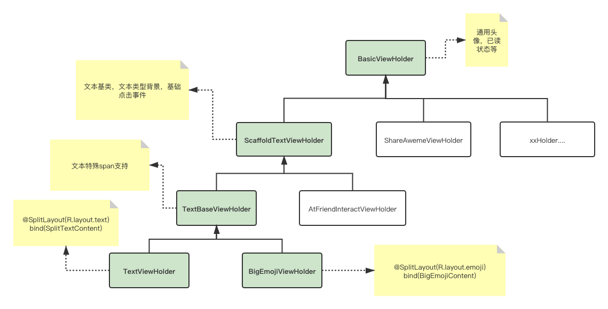
<!-- 图片：类结构图，最顶层是 BasicViewHolder（通用头像，已读状态等），其下三个分支：ScaffoldTextViewHolder（文本基本，文本类型背景，基础点击事件）、ShareAwemeViewHolder、xxHolder…；ScaffoldTextViewHolder 下分两个分支：TextBaseViewHolder（文本特殊 span 支持）和 AtFriendInteractViewHolder；TextBaseViewHolder 下分 TextViewHolder（@SplitLayout(R.layout.text) bind(SplitTextContent)）和 BigEmojiViewHolder（@SplitLayout(R.layout.emoji) bind(BigEmojiContent)）。 -->

```kotlin
//1.定义纯文本数据
//这次使用@CustomResolver表示这次是自定义解析逻辑, 需要override一个函数resolve，表示对于一个给定的eachMsg，是否能解析成TextData
//其他不变
@CustomResolver
open class TextData(msg: Message) : BaseData<TextContent>(msg) {
    override fun resolve(eachMsg: Message): Boolean {
        return if (eachMsg.msgType == PlatformEnum.MessageType.TEXT) {
            !isBigEmoji(eachMsg)
        } else {
            false
        }
    }

    protected fun isBigEmoji(msg: Message): Boolean {...}
}

//2. 定义纯文本对应的ViewHolder
@SplitViewHolderDef(contentClazz = TextData::class)
class TextViewHolderFactory : BaseViewHolderFactory<TextViewHolder>() {
    override fun createViewHolder(context: Context, parent: ViewGroup)
    : TextViewHolder {...}
}

open class TextViewHolder(itemView: View)
: ScaffoldTextViewHolder<TextData>(itemView) {...}


//3. 定义大表情数据
@CustomResolver
class BigEmojiData(msg: Message) : TextData(msg) {
    override fun resolve(eachMsg: Message): Boolean {
        return if (eachMsg.msgType == PlatformEnum.MessageType.TEXT) {
            isBigEmoji(eachMsg)
        } else {
            false
        }
    }
}

//4. 定义大表情对应的ViewHolder
@SplitViewHolderDef(contentClazz = BigEmojiData::class)
class BigEmojiViewHolderFactory : BaseViewHolderFactory<BigEmojiViewHolder>() {
    override fun createViewHolder(context: Context, parent: ViewGroup)
    : BigEmojiViewHolder {...}
}

//Holder复用继承
class BigEmojiViewHolder(itemView: View) : TextViewHolder(itemView) {
    override fun setContentBackgroundResource(config: StyleConfig) {}
    override fun highlightBgColor() {
        basicHighLightBgColor()
    }
}
```

### 4.3 理解设计

1. 整个框架分为两部分，ViewHolder 部分和 Data 部分，两者是分离的，Data 部分是为了消息详情页复杂的解析逻辑设计的，而 ViewHolder 部分是通用的，即声明一个 ViewHolderFactory 即可完成 ViewHolder 对 RecyclerView 的注册，其注解可以是任意数据类

2. Data 部分的注解 AutoResolver 和 CustomResolver 分别用于处理简单映射类型和复杂的自定义逻辑类型。可以参照之前 MessageViewType.java 来理解

⚠️⚠️⚠️ NOTE: 注意 CustomResolver 是对每个消息都会进行匹配，因此耗时是 O(n) 的，AutoResolver 是 hashMap 映射，因此耗时是 O(1) 的，如果在 CustomResolver 用耗时逻辑会影响性能，而且 customResolver 的参数 priority 默认是 Low，即默认在 HashMap 解析不了再解析，只有特殊情况才能设置为 High

什么是简单映射？即某一个类型的 msg 由唯一确认的 ViewHolder 来处理它，如下 holder 的选取可以理解是只跟 msg 的 type 有关系

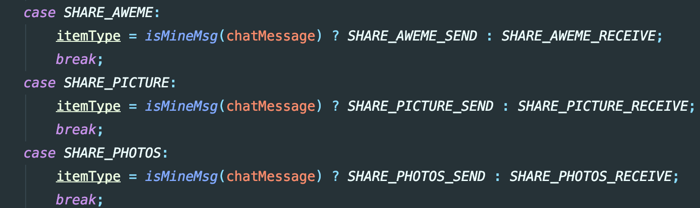
<!-- 图片：代码截图，包含三个 case 分支 SHARE_AWEME、SHARE_PICTURE、SHARE_PHOTOS，每个分支内通过 isMineMsg(chatMessage) 条件判断，将 itemType 赋值为 _SEND 或 _RECEIVE 后缀的常量，每个分支末尾都有 break;。 -->

什么是复杂类型？即解析一个 msg 有自定义逻辑的时候，如下 holder 的选取跟 msg 里面的 content 有关系

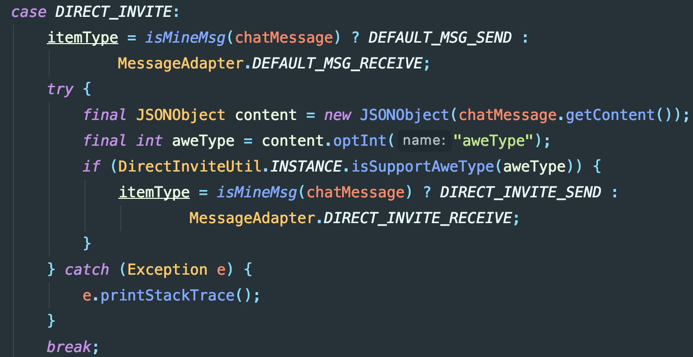
<!-- 图片：代码片段，DIRECT_INVITE case 分支：先通过 isMineMsg(chatMessage) 将 itemType 初始化为 DEFAULT_MSG_SEND 或 MessageAdapter.DEFAULT_MSG_RECEIVE；try 块中从 chatMessage 获取内容并解析为 JSONObject，提取 "aweType" 整数值，若 DirectInviteUtil.INSTANCE.isSupportAweType(aweType) 为 true 则 itemType 更新为 DIRECT_INVITE_SEND 或 MessageAdapter.DIRECT_INVITE_RECEIVE；catch 块捕获 Exception 并打印堆栈跟踪。 -->

来看下数据流转 (绿色背景表示 apt 管理，红色部分表示业务逻辑)：向 Adapter 添加一个 message 数据，split 框架根据是 CustomResolver 还是 AutoResolver 来决定如何解析成相应的 Data，CustomResolver 注解可以根据参数 (High or Low) 决定解析优先级是优于还是低于 AutoResolver。拿到 Data 数据后，split 框架从 ViewTypeManager 文件中去找到对应的 ViewHolder，然后调用 bind 逻辑

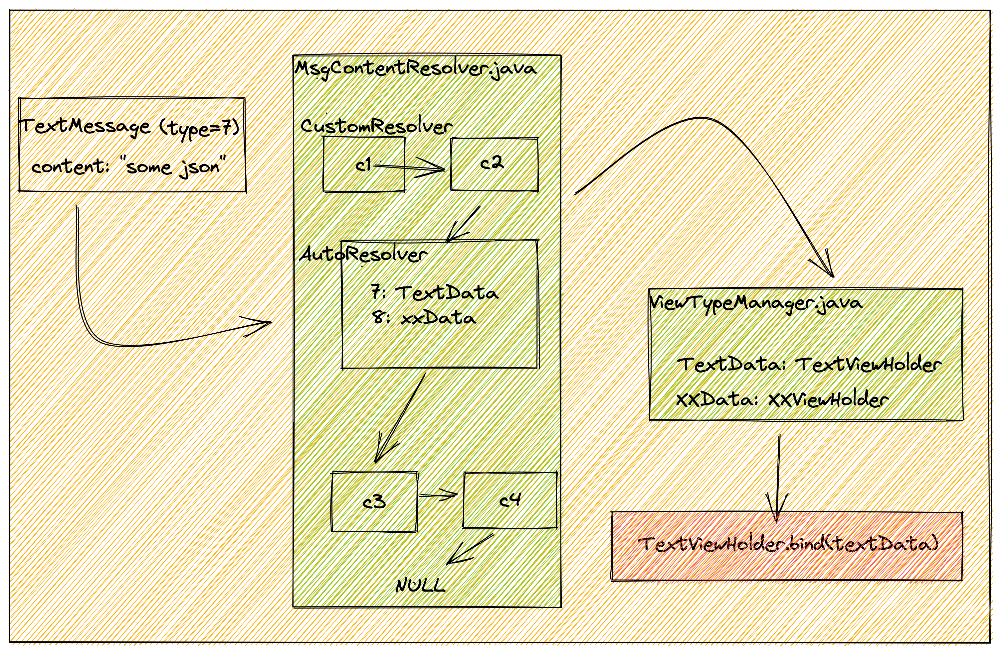
<!-- 图片：流程图，左侧 TextMessage(type=7) (content: "some json") 指向 MsgContentResolver.java，内部上方 CustomResolver 含 c1 → c2，下方 AutoResolver 含 7: TextData / 8: xxData，c3 → c4，c4 下方 NULL；MsgContentResolver 指向 ViewTypeManager.java（TextData: TextViewHolder / xxData: XXViewHolder），ViewTypeManager 下方指向 TextViewHolder.bind(textData)。 -->

### 4.4 最佳实践：我如何加一个新的消息类型？

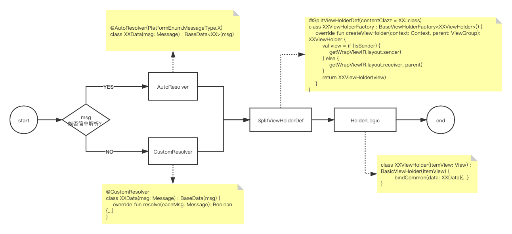
<!-- 图片：流程图，从 start 开始，菱形判断 "msg能否简单解析？"，YES 分支指向 AutoResolver（@AutoResolver(PlatformEnum.MessageType.X) class XXData(msg: Message) : BaseData<XX>(msg)），NO 分支指向 CustomResolver（@CustomResolver class XXData(msg: Message) : BaseData(msg) { override fun resolve(eachMsg: Message): Boolean {...} }）；两者都连接到 SplitViewHolderDef（@SplitViewHolderDef(contentClazz = XX::class) class XXViewHolderFactory : BaseViewHolderFactory<XXViewHolder>()），最后是 HolderLogic（class XXViewHolder(itemView: View) : BasicViewHolder(itemView) { bindCommon(data: XXData){...} }），结束于 end。 -->

#### 4.4.1 是否需要增加对应的引用样式

注意：因为引用回复已成为一种基础能力，**在添加一种新消息类型时应同时考虑该消息类型是否能够被引用回复**，并且使用 Sire 引用回复框架接入 [新引用 Sire 快速接入手册](https://bytedance.feishu.cn/docs/doccnt04IwbK6h0ICuZwkiX6gpf)。

### 4.5 原理

核心原理是 apt，把之前多个需要枚举的地方用 apt 生成代码，因此可以做到开闭原则。下面是一些代码片段，我会把 msg 和 adapter Type 以及 viewholder 产生映射关系，以此来简化代码

（apt 部分）

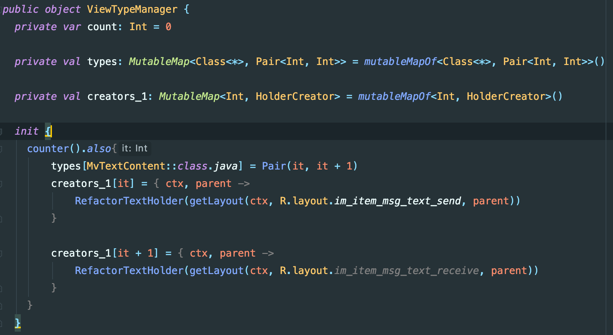
<!-- 图片：代码截图，ViewTypeManager 公共对象的 Kotlin 代码：count（Int 初始值 0）、types（MutableMap<Class<*>, Pair<Int, Int>>）、creators_1（MutableMap<Int, HolderCreator>）。在 init 块中，调用 counter() 并通过 also 获取返回值 it: Int，将 types["MvTextContent::class.java"] 设为 Pair(it, it+1)；为 creators_1[it] 和 creators_1[it+1] 添加 lambda（接收 ctx, parent 返回 RefactorTextHolder 实例，分别使用 R.layout.im_item_msg_text_send 和 R.layout.im_item_msg_text_receive）。 -->

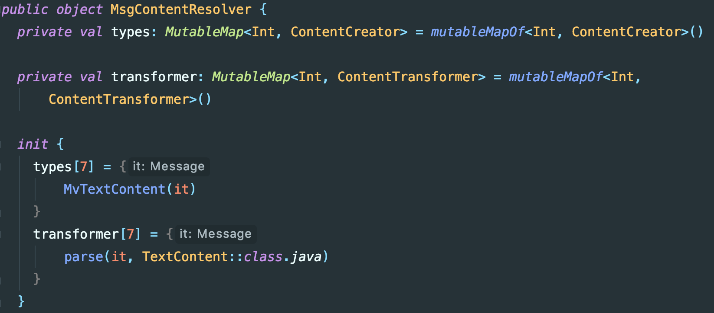
<!-- 图片：代码截图，MsgContentResolver 公共对象，包含两个私有可变映射：types（Int → ContentCreator）和 transformer（Int → ContentTransformer），init 中 types[7] 赋值为接收 Message 返回 MvTextContent 实例的 lambda，transformer[7] 赋值为调用 parse(it, TextContent::class.java) 的 lambda。 -->

（runtime 部分）

可以看到 adapter 部分相当简单，并且是完全贴合官方设计的，简单易懂

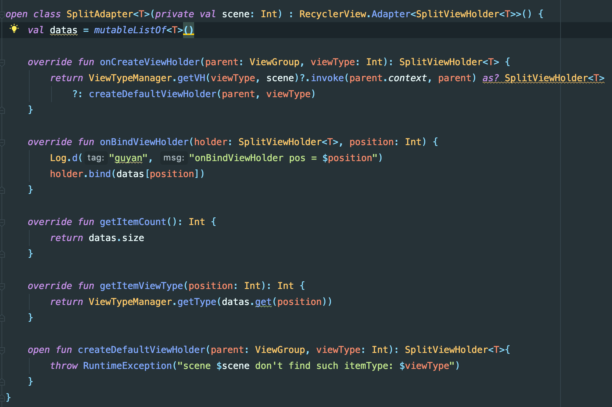
<!-- 图片：代码截图，SplitAdapter<T>(scene: Int) 继承 RecyclerView.Adapter<SplitViewHolder<T>>，包含 datas = mutableListOf<T>()；重写 onCreateViewHolder（通过 ViewTypeManager.getVH 获取 ViewHolder，若为空调用 createDefaultViewHolder）、onBindViewHolder（holder.bind）、getItemCount、getItemViewType（ViewTypeManager.getType(datas.get(position))）；createDefaultViewHolder 抛出 RuntimeException("scene $scene don't find such itemType: $viewType")。 -->

## 5 使用对比

### 5.1 Adapter

Before: 声明很多 type，与此类无关的代码较多，逻辑复杂，line 3500+

```java
public class MessageAdapter extends AbsMessageAdapter {
    public static final int NONE = -1;
    // 系统消息notice等
    public static final int SYSTEM_MSG_RECEIVE = 0;
    // 文字消息
    public static final int TEXT_MSG_RECEIVE = 1;
    public static final int TEXT_MSG_SEND = 2;
    // 分享视频消息
    public static final int SHARE_AWEME_RECEIVE = 3;
    public static final int SHARE_AWEME_SEND = 4;
    //...
 }
```

After: 职责清晰，就是转换数据到 ui

```kotlin
open class SplitAdapter<T>(private val scene: Int) : RecyclerView.Adapter<SplitViewHolder<T>>(),ISplitMessageViewWrapper {
    val datas = mutableListOf<T>()

    init {
        ViewTypeManager.setViewWrapper(this)
    }

    override fun onCreateViewHolder(parent: ViewGroup, viewType: Int): SplitViewHolder<T> {
        return ViewTypeManager.getVH(viewType, scene)
            ?.invoke(parent.context, parent) as? SplitViewHolder<T>
            ?: createDefaultViewHolder(parent, viewType)
    }

    override fun onBindViewHolder(holder: SplitViewHolder<T>, position: Int) {
        holder.bind(datas[position])
    }

    override fun getItemCount(): Int {
        return datas.size
    }

    override fun getItemViewType(position: Int): Int {
        return ViewTypeManager.getType(datas.get(position))
    }

    open fun createDefaultViewHolder(parent: ViewGroup, viewType: Int): SplitViewHolder<T> {
        throw RuntimeException("scene $scene don't find such itemType: $viewType")
    }
}
```

### 5.2 ViewHolder

before：每个 ui 类型定义一种 ViewHolder，泛型指定该 Msg 能够解析成的数据 Content，receive 和 send 分开两个 ViewHolder

```java
public class TextBaseViewHolder extends ScaffoldTextViewHolder<TextContent> {
    @Override
    public void bind(Message msg, Message preMsg, TextContent content, int position) {}
```

after：基本没有变化，泛型指定需要继承自 SplitContent，这是个简单的数据类，封装了 Message 和它对应的 Content，因为一般来说 sender 和 receiver 的逻辑比较接近，可以看到 receiver 和 sender 是共用一个 ViewHolder 的，相同逻辑写入 bindCommon，自己独特逻辑写入其他各自函数

```kotlin
open class TextViewHolder(itemView: View)
: ScaffoldTextViewHolder<TextData>(itemView) {...}
class TextViewHolder(itemView: View) : BasicViewHolder<SplitTextContent>(itemView) {
    override fun bindReceiver(item: SplitTextContent) {}

    override fun bindSender(item: SplitTextContent) {}

    override fun bindCommon(item: SplitTextContent) {}
}
```

### 5.3 ClickListener

Before: All in MessageAdapter，点击事件的区分以及数据传递需要依靠 View 的 Tag 来传递，line 1000+

长按事件是否展示某个功能（复制，转发等）也需要根据 Tag 来区分，逻辑一旦复杂就难以维护

```typescript
public void onClick(final View v) {
    if (v.getTag(KEY_TYPE_ITEM) == null) {return;}

    final Message chatMessage = (Message) v.getTag(KEY_TYPE_DATA);
    final int tagType = (int) v.getTag(KEY_TYPE_ITEM);

    if (tagType == TYPE_ITEM_VIDEO ||tagType == TYPE_ITEM_SHARE_PIC) {
                         //...
    }else if (tagType == TYPE_ITEM_AVATAR) {
                         //...
    }else if///...
```

```typescript
private int convert2Flag(int tagType, boolean isSuccess, boolean isDefault, boolean isSelf, boolean isEnterPriseChat,
                         Message message, BaseContent content) {
    int flag = 0x01;
    // 如果视频不显示卡片，那么只保留长按删除，其余选项全部隐藏
    if (tagType == TYPE_ITEM_VIDEO && !AwemePreloadHelper.INSTANCE.isAwemeNormal(message)) {
        return 0x01;
    }
    //计算 copy bit
    if (tagType == TYPE_ITEM_TEXT ||
            tagType == TYPE_ITEM_STORY_REPLY ||
            tagType == TYPE_ITEM_XPLAN_DEFAULT_MSG ||
            tagType == TYPE_ITEM_SELF_STORY_REPLY ||
            tagType == TYPE_ITEM_XPLAN_HEART) {
        flag += FLAG_COPY;
    } else {
        flag += 0;
    }
    //计算 recall bit
    if (tagType == TYPE_ITEM_RED_ENVELOPE
            || tagType == TYPE_ITEM_CHAT_CALL
            || tagType == TYPE_ITEM_RED_PACKET
            || tagType == TYPE_ITEM_SHARE_FANS_COUPON_CARD
            || tagType == TYPE_ITEM_VIDEO_UPDATE_TIPS
            || tagType == TYPE_ITEM_XPLAN_HEART
            || tagType == TYPE_ITEM_SUBSCRIBE_CARD) {
        flag += 0;
    } else if (!isSuccess || isDefault || !isSelf) {
        flag += 0;
    } else {
        flag += FLAG_RECALL;
    }
   //....
}
```

After: 每个 viewHolder 内部自己决定是否要显示长按菜单，以及显示哪些 item，针对点击事件也可以个性化处理

```kotlin
//inside view holder
override fun provideConfig(message: Message, content: BaseContent?): LongClickConfig {
    return object : DefaultLongClickConfig(itemView.context, message, content) {
        override fun showCopy(): Boolean {
            return true
        }
    }
}

override fun provideHandler(message: Message, content: BaseContent?): LongClickHandler {
    return object : DefaultLongClickHandler(itemView.context, message, content) {
        override fun onClickCopy(v: View) {
            val text = (content as TextContent).text
            Options.copyToClipbord(v.context, text)
            val bundle: Bundle = generateBackFlowParams()
            bundle.putString(BACKFLOW_CHECK_CLIPMASSAGE, text)
            bundle.putString(Mob.ENTER_FROM, Mob.CHAT)
            ShareProxyService.shareService().runBackFlow(bundle)
        }
    }
}
```

### 5.4 参数传递

before：如果 viewHolder 内部需要外部能力，比如当前会话的环境变量 SessionInfo（可以知道是单聊还是群聊，半屏还是全屏等等），需要从 fragment 层逐层传递到需要的地方

```kotlin
//basePanel
class BaseChatPanel(val lifecycleOwner: LifecycleOwner, val rootView: View, protected val sessionInfo: SessionInfo)

//adapter
class MessageAdapter(SessionInfo sessionInfo,
                          IMUser mine) {
        mSessionInfo = sessionInfo;
}

//viewHolder
public void injectSessionInfo(SessionInfo sessionInfo) {
    this.mSessionInfo = sessionInfo;
}
```

After: 由于 ViewHolder 的设计是分离式的，因此需要避免层层传递的问题，基于 ViewModel 做了一个简单的 kv 存储，生命周期可以依赖于 activity，可依赖于 fragment，无泄漏风险

```kotlin
//basePanel
private fun injectParam() {
    InjectionViewModel.inject(mActivity, "sessionInfo", sessionInfo)
    InjectionViewModel.inject(mActivity, "LongClickDataProvider", mMessageHandle)
    InjectionViewModel.inject(mActivity, "DelegateAdapter", mMessageAdapter)
}

//viewHolder
protected val mSessionInfo: SessionInfo? = injectNullable("sessionInfo")

//context
val sessionInfo: SessionInfo? = context.injectNullable("sessionInfo")
```

## 6 编译时间影响

带有 split 的 kapt 耗时


<!-- 图片：三个任务及其耗时，:im.base:kaptGenerateStubsDouyinCnDebugKotlin 49.704s、:im.base:generateDouyinCnDebugRFile 19.487s、:im.base:kaptDouyinCnDebugKotlin 10.161s（kapt 被黄色矩形高亮）。 -->

不带有 split 的耗时

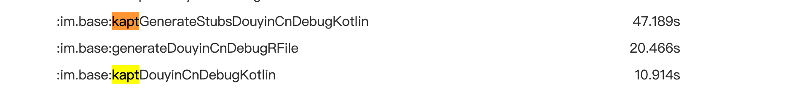
<!-- 图片：三行任务耗时，:im.base:kaptGenerateStubsDouyinCnDebugKotlin 47.189s（kapt 橙色框）、:im.base:generateDouyinCnDebugRFile 20.466s、:im.base:kaptDouyinCnDebugKotlin 10.914s（kapt 黄色框）。 -->

可以看到，基本没有什么影响，因为之前就用了 kapt 功能（butterknife），因此这次的编译耗时可以忽略不计

## 7 迁移

由于目前消息种类非常多，如果我们全部重写 viewHolder 显然是难以实现的。因此考虑分步走

1. 第一步先梳理 MessageAdapter 的逻辑，把原本不属于 Adapter 应该的职责抽离出来，这一步实现后方可实现 SplitAdapter 与 MessageAdapter 共存。因为这一步改动结构较大，因此计划独立灰度一波，改动点主要如下
   1. 抽离 MessageAdapter 里面无关逻辑到 MessageHandle，从职责分析，我们可以把 MessageHandle 看做 MVP 架构的 Presenter（MVVM 的 VM 部分），它负责与 imsdk 交互获取数据，也负责调用 ui 层的刷新
   2. 抽离 MessageAdapter 点击事件，包括 clickListener 和 LongClickListener
   3. 引入 DelegateAdapter 替换原有所有引用 MessageAdapter 的地方，并且在其内部决定各个消息类型的分发，即重构的消息类型转发给 SplitAdapter，旧版的消息类型给 MessageAdapter

2. 第二步梳理现存 Viewholder 情况，每个版本适当迁移几个新消息类型到 SplitAdapter，长期看所有消息类型都完成迁移，即可删除原有 MessageAdapter 逻辑

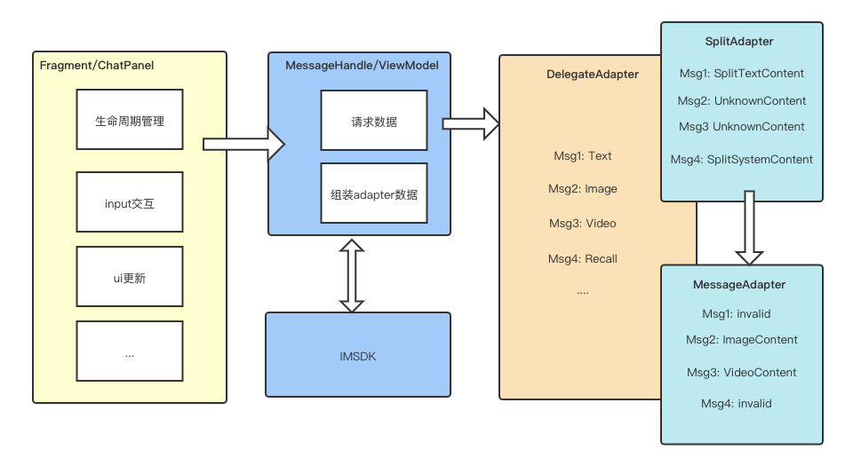
<!-- 图片：流程图，左侧 Fragment/ChatPanel（生命周期管理、input交互、ui更新…）指向 MessageHandle/ViewModel（请求数据、组装adapter数据），右侧指向 DelegateAdapter（Msg1: Text / Msg2: Image / Msg3: Video / Msg4: Recall …），DelegateAdapter 连接 SplitAdapter（Msg1: SplitTextContent / Msg2: UnknownContent / Msg3: UnknownContent / Msg4: SplitSystemContent）和 MessageAdapter（Msg1: invalid / Msg2: ImageContent / Msg3: VideoContent / Msg4: invalid）；MessageHandle/ViewModel 与 IMSDK 双向交互。 -->

```kotlin
//DelegateAdapter
private val refactorGroup: List<Int> = listOf(
        PlatformEnum.MessageType.TEXT
        //迁移过程不断add
)

private val matcher: (Message) -> Boolean = {
    if (it.isRecalled) {
        true
    } else {
        it.msgType in refactorGroup
    }
}

override fun getItemViewType(position: Int): Int {
    val switchPosition = switchItemPos2DataPos(position)
    return if (matcher(mData[switchPosition])) {
        splitAdapter.getItemViewType(switchPosition).also {
            splitTypes.add(it)
        }
    } else {
        messageAdapter.getItemViewType(position)
    }
}

override fun onCreateViewHolder(parent: ViewGroup, viewType: Int): BaseViewHolder<BaseContent> {
    val viewHolder = if (splitTypes.contains(viewType)) {
        val splitHolder = splitAdapter.onCreateViewHolder(parent, viewType)
        ProxySplitViewHolder(splitHolder.itemView, viewType, splitHolder)
    } else {
        messageAdapter.onCreateViewHolder(parent, viewType)
    }
}

override fun onBindViewHolder(holder: BaseViewHolder<BaseContent>, position: Int, payloads: List<Any>) {
    val switchPosition = switchItemPos2DataPos(position)
    if (holder is ProxySplitViewHolder) {
        splitAdapter.onBindViewHolder(holder.splitViewHolder, switchPosition)
    } else {
        messageAdapter.onBindViewHolder(holder, position, payloads)
    }
}
```

## 8 总结

Split 是一种基于 apt 的代码生成解决方案，解决了传统 RecyclerView 相关的模板代码，简单易理解。其低耦合体现在各个 viewholder 之间相互隔离，新增类型简单快捷。其内聚性体现在各个 viewholder 的点击事件，展现时机等等封装在业务内部，各个组件分而治之。因此除了消息列表页，在会话列表等类型较多的 RecyclerView 使用的场景下，这是一个通用的解决方案
