## 1 简介

一句话描述，Rips是一个轻量级的页面内的组件化框架，可以基于页面内以view作为维度，拆分成逻辑独立的组件以达到逻辑解耦、复用等目的。可以认为是"更轻量级的fragment"

## 2 如何使用

Rips是一个单项数据流框架，一个组件包含三个元素

**ui元素**: 描述一个组件长成什么样子

**logic元素**: 描述一个组件的数据从何而来

**state元素**： 对ui的抽象，dataClass, 是ui和logic的粘合剂

### 2.1 Fragment视角

从activity或者fragment的视角，它们不再存在业务逻辑，唯一的任务是组装组件。由于rips支持组件嵌套，因此我们先在fragment层面定义一个Root组件

```kotlin
//RipsChatRoomFragment.kt
override fun onCreateView(inflater: LayoutInflater, container: ViewGroup?, savedInstanceState: Bundle?): View? {
    return inflater.inflate(R.layout.im_chat_room_rips_root_layout, container, false)
}

override fun onViewCreated(view: View, savedInstanceState: Bundle?) {
    super.onViewCreated(view, savedInstanceState)
    //...
    scopedData {
        provider {
            sessionInfo
        }
    }

        attach {
            bindRipsUI()
    }
    //...
}

protected open fun RipsVM.bindRipsUI(){
    bind(SingleChatRoomRootUI(this@RipsChatRoomFragment), R.id.rips_root_container)
}
```

Root组件里面可以存在不属于其他任何组件的公共逻辑，以及安排各个位置应该显示什么组件。可以看到我们现在xml里面为每个组件占坑，然后指定每个坑位绑定的组件

```xml
<?xml version="1.0" encoding="utf-8"?>
<FrameLayout xmlns:android="http://schemas.android.com/apk/res/android"
    xmlns:tools="http://schemas.android.com/tools"
    android:id="@+id/chat_root_layout"
    android:layout_width="match_parent"
    android:layout_height="match_parent">

    <!--可以用viewStub或者任何ViewGroup占位-->

        <ViewStub
            android:id="@+id/chat_title_container"
            android:layout_width="match_parent"
            android:layout_height="wrap_content" />

        <LinearLayout
            android:id="@+id/top_bar_container"
            android:layout_width="match_parent"
            android:layout_height="wrap_content"
            android:orientation="vertical" />

 </FrameLayout>
```

```kotlin
//ChatRoomRootUI.kt
override fun onCreate() {
    super.onCreate()
    attach {
    measureVMTime("rips_vm_setupUI") {
        val isReport = sessionInfo.selectMsgType == EnumType.SELECT_MSG_REPORT
        if (isReport) {
            bind(ReportChatListUI(owner), R.id.chat_list_container)
            bind(ReportTitleUI(owner), R.id.chat_title_container)
        } else {
            bindTitle()
            bind(InputUI(owner), R.id.input_container)
            bind(UnreadTipsUI(owner), R.id.unread_message_tips_container)
            bind(InputPanelUI(owner), R.id.panel_container)
            bind(NewMsgTipsUI(owner = owner), R.id.new_message_tips_view_container)
            bind(InteractiveUI(owner), R.id.im_interactive_emoji_container)
            bind(AudioUI(owner), R.id.audio_container)
            bind(GifBattleCountUI(owner), R.id.gif_battle_count_container)
            bind(GifSearchResultUI(owner), R.id.layout_panel_gif_view_container)
            bind(LocalMessageUI(owner), R.id.chat_bottom_card_container)
            bind(GifSearchUI(owner), R.id.gif_search_container_old)
            bindTopTips()
            bindMessageList()
            if (VoiceOptExperiment.enableNew) {
                bind(AudioTouchUI(owner), R.id.touch_container)
            }
        }
    }
}
}
```

### 2.2 UI元素视角

1. 泛型部分绑定了logic元素和state元素

2. layoutResource函数返回当前组件布局

3. onViewCreated类似fragment的api不再赘述

4. 可以观察uiState的数据来改变ui

因此ui元素只做ui相关操作，显示or隐藏，是否展示动画等

```kotlin
class UnreadTipsUI(owner: ViewModelStoreOwner) : RipsUI<UnreadTipsLogic, UnreadTipsState>(owner) {

    companion object {
        const val TAG = "UnreadTipsUI"
    }

    private val mContext: Context = find()
    private lateinit var mUnreadMessageTips: View
    private lateinit var mUnreadMessageCount: DmtTextView
    private var mUnreadMessageImage: ImageView? = null

    override fun layoutResource(): Int {
        return R.layout.im_view_stub_unread_message_tips
    }

    override fun onViewCreated(myView: View) {
        super.onViewCreated(myView)
        //findViewById等逻辑
        //观察数据
        uiState.observe(find()) {
            if (it.show) {
                it.marginTop?.also { top ->
                    (myView.layoutParams as? ViewGroup.MarginLayoutParams)?.topMargin = top
                }
                if (myView.visibility != View.VISIBLE) {
                    showUnreadMessageTips(it.unreadCount)
                }
            } else {
                hideUnreadMessageTips()
            }

            if (it.showLoadingAnimation) {
                mUnreadMessageImage?.setImageDrawable(ContextCompat.getDrawable(find(), R.drawable.im_ic_refresh_small))
                mUnreadMessageImage?.startAnimation(mImageRotateAnimation)
            } else {
                mUnreadMessageImage?.clearAnimation()
            }
        }
}
```

### 2.3 State元素视角

它是对ui的抽象，ui元素会观测它的字段来决定ui显示逻辑。定义为dataClass，属性为val， 以此来做单项数据流，这样ui层只能观测数据而不能改变它

```kotlin
data class UnreadTipsState(
    val show: Boolean,
    val unreadCount: Long = 0L
): State
```

### 2.4 Logic元素视角

logic元素是请求数据的地方，一般在onCreate里面发起该组件的数据请求，在任意地方调用setState去刷新ui。从结构上讲，logic元素只包含数据请求和组装部分，它并不知道ui怎么响应，它只是设置了State

```kotlin
class UnreadTipsLogic(injectionAware: InjectionAware)
    : BasicRipsLogic<UnreadTipsState>(injectionAware) {

    override fun onCreate() {
        super.onCreate()
        //伪代码
        //可以在任意地方调用setState即可更新ui
        retrofit().getUnreadCount{ count ->
            setState{
                copy(show = true, unreadCount = 10)
            }
        }
    }

    override fun onResume() {
        super.onResume()
    }
}
```

以上是最简单的一个rips组件demo，站在一个组件的角度，它必须知道自己显示成什么样(ui视角)，它必须知道数据来自哪里(logic视角)，它还需要知道自己被放到界面的哪个位置(fragment视角)。思考好这几点后自然就清楚一个rips组件如何去写了。

### 2.5 附：生命周期

单组件视角

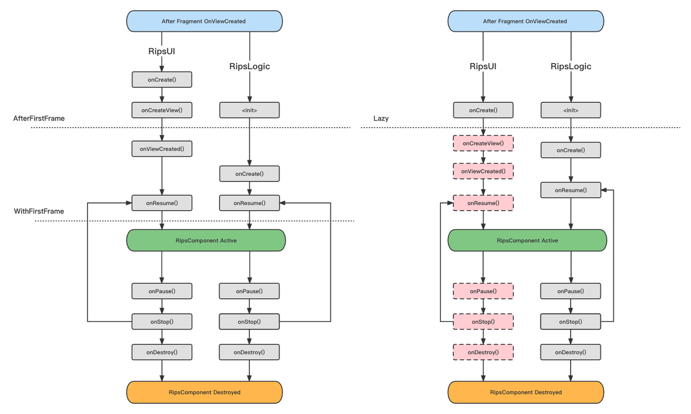

<!-- 图片说明：左右两个流程图，均以"After Fragment OnViewCreated"蓝色矩形框为起点。左侧标注"AfterFirstFrame"和"WithFirstFrame"两条虚线，右侧标注"Lazy"虚线。RipsUI 依次经过 onCreate() → onCreateView() → onViewCreated() → onResume()，RipsLogic 依次经过 \<init\> → onCreate() → onResume()，两者共同指向 RipsComponent Active，之后分别经过 onPause() → onStop() → onDestroy()，最终共同指向 RipsComponent Destroyed。 -->

框架视角

> 白板（白板内容描述）：流程图描述框架调度与并发执行任务，包含 ui-onCreate、firstframe-ui-onAttach、serviceLogic-onCreate、logic-onResume、onBootFinish 等生命周期方法，包含"框架调度""lifecycle调度""首屏渲染""退出界面""Post"等说明。

## 3 原理分析

### 3.1 界面是怎么展示的？

下面我们先来看看rips组件是如何运行起来的，以此来加深使用的理解。我们知道一个activity展示出来的步骤大概分为以下几步。首先调用startActivity后会调用前一个界面的onPause，然后调用目标Activity的onCreate，onResume，在onCreate里面我们先setContentView设置布局，然后接着请求数据，如果请求是异步的，则主线程会先发起measure、layout、draw然后显示界面首帧，此时是没有数据的，因此可能显示白屏、骨架图、loading等。等数据异步回来后再刷新ui，界面闪一下后就会正常展示了

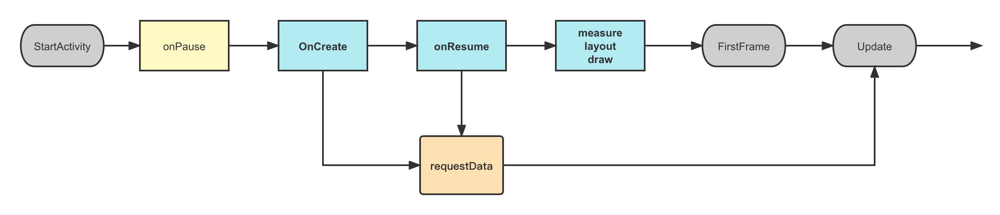

<!-- 图片说明：流程图 StartActivity → onPause → OnCreate → onResume → measure layout draw → FirstFrame → Update（含循环），其中 OnCreate 与 onResume 下方分支到 requestData，requestData 再回到 Update。 -->

上面的流程对应的是整个activity/fragment， 因此一旦界面复杂就可能在onCreate里面出现一堆获取view的代码，如果不同的ui部分数据来源不同，甚至需要顺序的去请求多个数据源，在获取到数据后，还需要把整个界面的数据拆分到各个view中去，因此fragment中代码往往特别复杂，且各个代码之前存在时序、逻辑等依赖，最后导致难以维护。rips考虑做界面内组件化，即把以上的这个生命周期图分发到每个组件中去

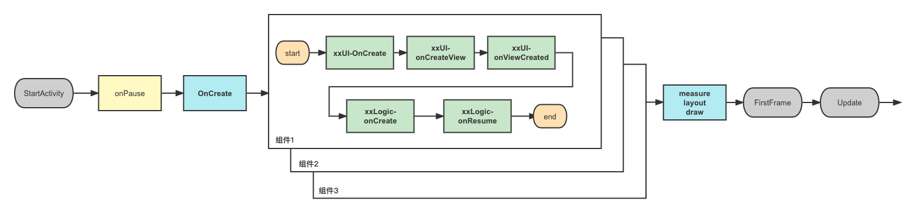

<!-- 图片说明：流程图，OnCreate 后进入虚线"组件1"，组件1 内部包含 start → xxUI-OnCreate → xxUI-onCreateView → xxUI-onViewCreated（含循环），同时分支到 xxLogic-onCreate → xxLogic-onResume → end；下方依次有"组件2""组件3"标签；之后流程汇入 measure layout draw → FirstFrame → Update。 -->

现在不同于原来，我们在界面绘制首帧前，定义一堆组件的生命周期。会循环调用所有组件的生命周期，用以执行它们各自的逻辑。比如框架调用UI元素的onCreateView，就会拿到当前组件的view然后把它塞到先前定义的坑位中，框架调用logic元素的onCreate就会发起数据流请求，等数据回来后就能刷新组件的ui。**从根本上讲我们没有改变系统展示一个界面的逻辑，只是自定义构建了一些组件元素插入到系统流程中而已**

### 3.2 从SysTrace看流程

下图是之前的逻辑流程，可以看到在ChatRoomActivity的onStart里面开始创建ChatRoomFragment，先调用onCreateView创建好布局，然后调用onViewCreated执行逻辑（这里就是BaseChatPanel里面的逻辑了），这个阶段执行完毕后系统回调下一个生命周期activityResume，然后就是执行绘制流程。

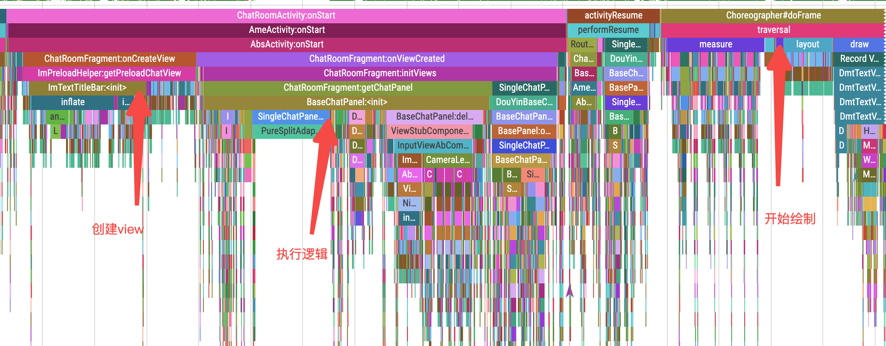

<!-- 图片说明：SysTrace 时间线，依次为 ChatRoomActivity:onStart、AmeActivity:onStart、AbsActivity:onStart、ChatRoomFragment:onCreateView（含 ImTextTitleBar 创建view）、ChatRoomFragment:initViews、getChatPanel、BaseChatPanel:\<init\>、SingleChatPanel...（执行逻辑）、activityResume、Choreographer:doFrame → traversal → measure → layout → draw（开始绘制）。 -->

这里有两个问题

1. 我们很难知道BaseChatPanel里面有多少逻辑，如果要衡量每个逻辑耗时就更不大可能了

2. 整个逻辑都是串行化的，性能优化做起来有困难，如果预加载来创建对象，这样可以，但是并不优雅，如果有多个需要预加载的对象，代码就会非常难看

```kotlin
//异步先创建
object: Preload{
    var xxManager: Manager? = null
    fun preload(){
        xxManager = createManager()
    }
}

//获取一次，如果没准备好就重新创建
class xxActivity: Activity{
    private manager: Manager? = null

    fun onCreate(){
        super.onCreate()
        manager = Preload.xxManager ?: createManager()
    }
}
```

然后让我们来看下rips的流程，我把整个fragment的生命周期整合成下面这样，大概分为3个阶段

1. 组件配置阶段，即下图红框左边的部分， 这部分rips框架会准备好各个组件之间的关系

2. 并发任务阶段，即下图红框的部分，这里也是rips最大特色的地方，它会充分利用多线程能力去加载所有组件（创建View和Logic）

3. 组件发布阶段，即红框右边的部分，当一个组件有了数据，创建好了view后，需要执行一些初始化逻辑，比如findViewById，把数据设置给view等等操作在这里执行

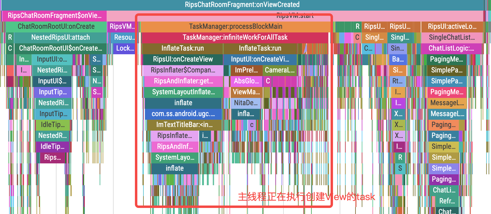

<!-- 图片说明：主线程时间线 RipsChatRoomFragment:onViewCreated，红框内为 TaskManager:processBlockMain → infiniteWorkForAllTask → InflateTask:run → RipsUI:onCreateView、InputUI:onCreateView、SystemLayoutInflater、inflate 等"主线程正在执行创建View的task"。 -->

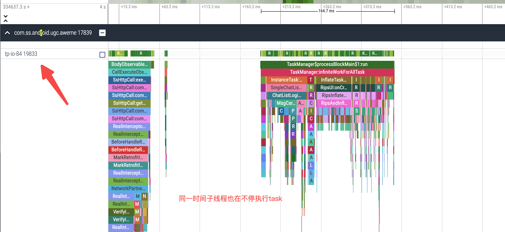

<!-- 图片说明：tp-io 子线程在同一时间也在执行 task（BodyObservable、CallExecuteObs、SsHttpCall.ex、TaskManager$processBlockMain$1.run、infiniteWorkForAllTask、InstanceTask、InflateTask、SingleChatList、RipsUI:onCr 等），标注"同一时间子线程也在不停执行task"。 -->

### 3.3 第一阶段：组件配置

我们来看看源码，起点是fragment里面的attach函数，从dsl的角度，它表示的是一个把xxUI和坑位绑定到一起的语义

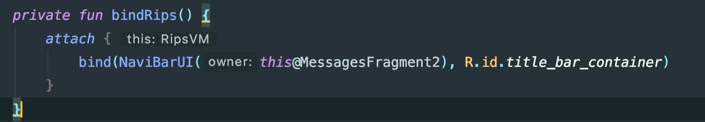

<!-- 图片说明：代码片段，私有函数 bindRips 中包含 attach 代码块（this 类型为 RipsVM），内部调用 bind(NaviBarUI(owner = this@MessagesFragment2), R.id.title_bar_container)。 -->

bind函数只是一个记录操作，把对应id和ui放到一个map中保存映射关系，同时会回调组件的onCreate函数，而在嵌套组件onCreate里面可以继续bind自己的子组件，同样子组件的映射关系也会添加到这个map中

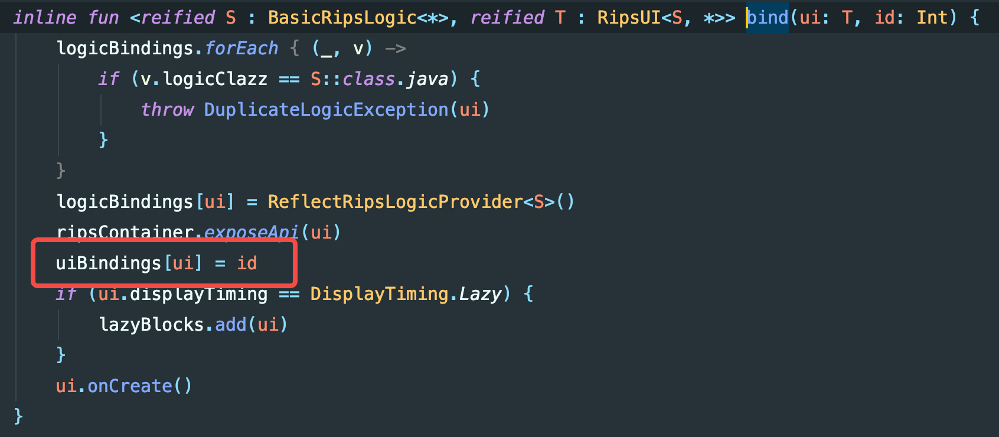

<!-- 图片说明：代码片段，inline fun \<reified S : BasicRipsLogic\<\*\>, reified T : RipsUI\<S, \*\>\> bind(ui: T, id: Int)，逻辑包括：检查 logicBindings 中是否已存在 S::class.java，否则抛 DuplicateLogicException(ui)；设置 logicBindings[ui] = ReflectRipsLogicProvider\<S\>()；调用 ripsContainer.exposeApi(ui)；uiBindings[ui] = id（红框）；若 ui.displayTiming == DisplayTiming.Lazy 则添加到 lazyBlocks；最后调用 ui.onCreate()。 -->

这个时候内存里面的UI树大概是下面这个样子

### 3.4 第二阶段：任务并发

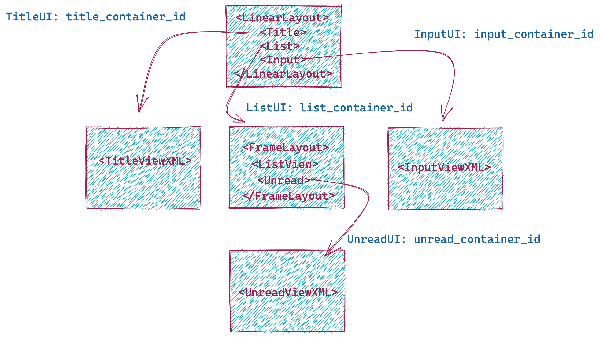

<!-- 图片说明：UI 树结构，\<LinearLayout\> 包含 \<Title\>、\<List\>、\<Input\>，分别绑定 TitleUI: title_container_id、ListUI: list_container_id、InputUI: input_container_id；ListUI 中的 \<FrameLayout\> 包含 \<ListView\>、\<Unread\>，\<Unread\> 关联到 UnreadUI: unread_container_id 的 \<UnreadViewXML\>。 -->

这也是rips这个名字的来源，有一款AMD的cpu叫线程撕裂者ThreadRipper, 这个地方最大化利用了多线程的能力去完成一些耗时任务。业务开发无非就关心两个事，view怎么展示？数据怎么存储？这里最耗时的就是创建view和数据获取了。因此我的思路是把所有必须的、耗时的工作task化，然后在一段时间内统一执行

attach函数里面会创建一个RipsVM的ViewModel，因此rips的生命周期是跟随外层的activity或者fragment的，不会内存泄漏

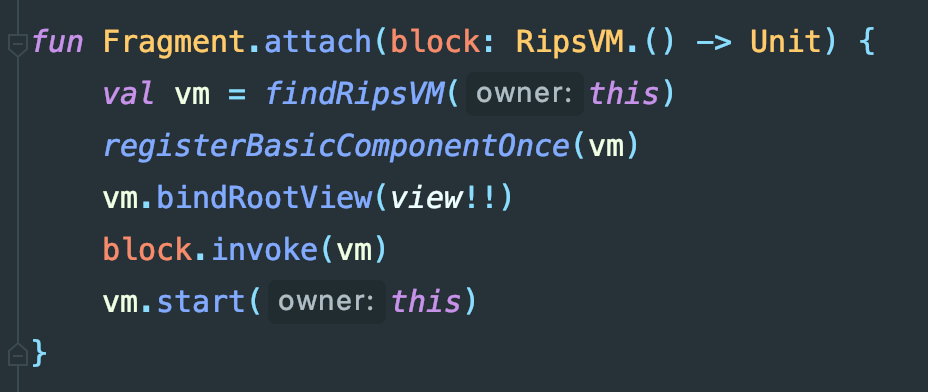

<!-- 图片说明：代码片段，Fragment.attach(block: RipsVM.() -\> Unit) { val vm = findRipsVM(owner = this); registerBasicComponentOnce(vm); vm.bindRootView(view!!); block.invoke(vm); vm.start(owner = this) }。 -->

来看看start函数干了什么? 把两种类型的task，uiTask和logicTask放到taskManager里面去，uiTask顾名思义是创建view的任务，它负责从xml中inflate出一个view实例来，比较耗时。logicTask即创建logic实例的任务，这个也可能耗时

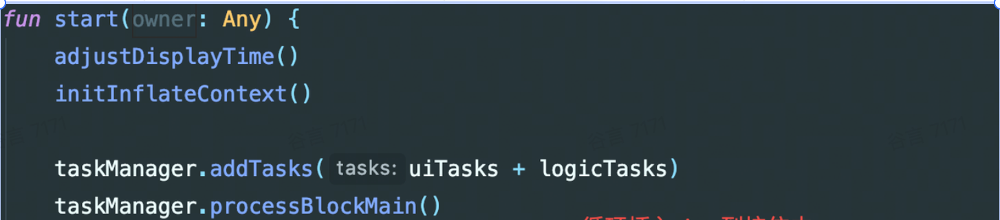

<!-- 图片说明：代码片段 fun start(owner: Any) { adjustDisplayTime(); initInflateContext(); taskManager.addTasks(tasks = uiTasks + logicTasks); taskManager.processBlockMain() }。 -->

这里解释下， 我们的xxLogic组件里面是请求界面数据的逻辑，往往会用到一些model层的类，比如定义一个属性val manager = xxManager(), 你很难知道这个xxManager的构造函数里面是否有耗时逻辑，这样在原来就很容易劣化性能而不自知。但是我们的Logic组件可能是在异步线程创建的，onCreate函数是在主线程调用的，这样就能比较优雅异步化一些耗时逻辑

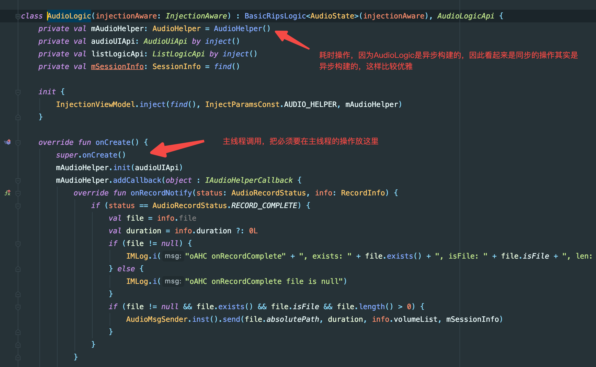

<!-- 图片说明：代码片段，AudioLogic 类继承 BasicRipsLogic\<AudioState\> 并实现 AudioLogicApi，构造参数 InjectionAware；私有属性 mAudioHelper = AudioHelper()（注释为：耗时操作，因为AudioLogic是异步构建的，因此看起来是同步的操作其实是异步构建的，这样比较优雅）；audioUIApi、listLogicApi 通过 by inject() 注入；mSessionInfo 通过 find() 获取；init 块中调用 InjectionViewModel.inject()；onCreate() 调用 mAudioHelper.init(audioUIApi).addCallback(IAudioHelperCallback)（注释为：主线程调用，把必须要在主线程的操作放这里）。 -->

如果是普通写法则会这样

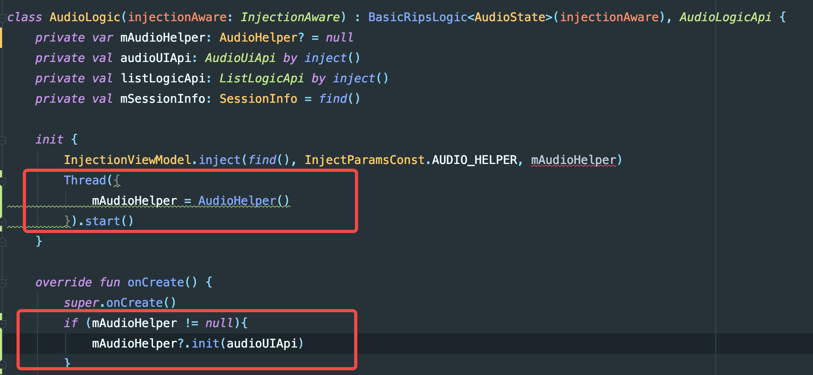

<!-- 图片说明：代码片段，AudioLogic 中 mAudioHelper 初始化为 null，init 块中启动新线程为 mAudioHelper 赋值为 AudioHelper() 实例（红框）；onCreate() 中判断 mAudioHelper 不为 null 时调用 mAudioHelper.init(audioUiApi)（红框）。 -->

最后调用TaskManager的processBlockMain，该函数会阻塞主线程直到所有任务都完成。这里设计了一个抢占式的任务队列，当所有任务都完成时，主线程才会放行

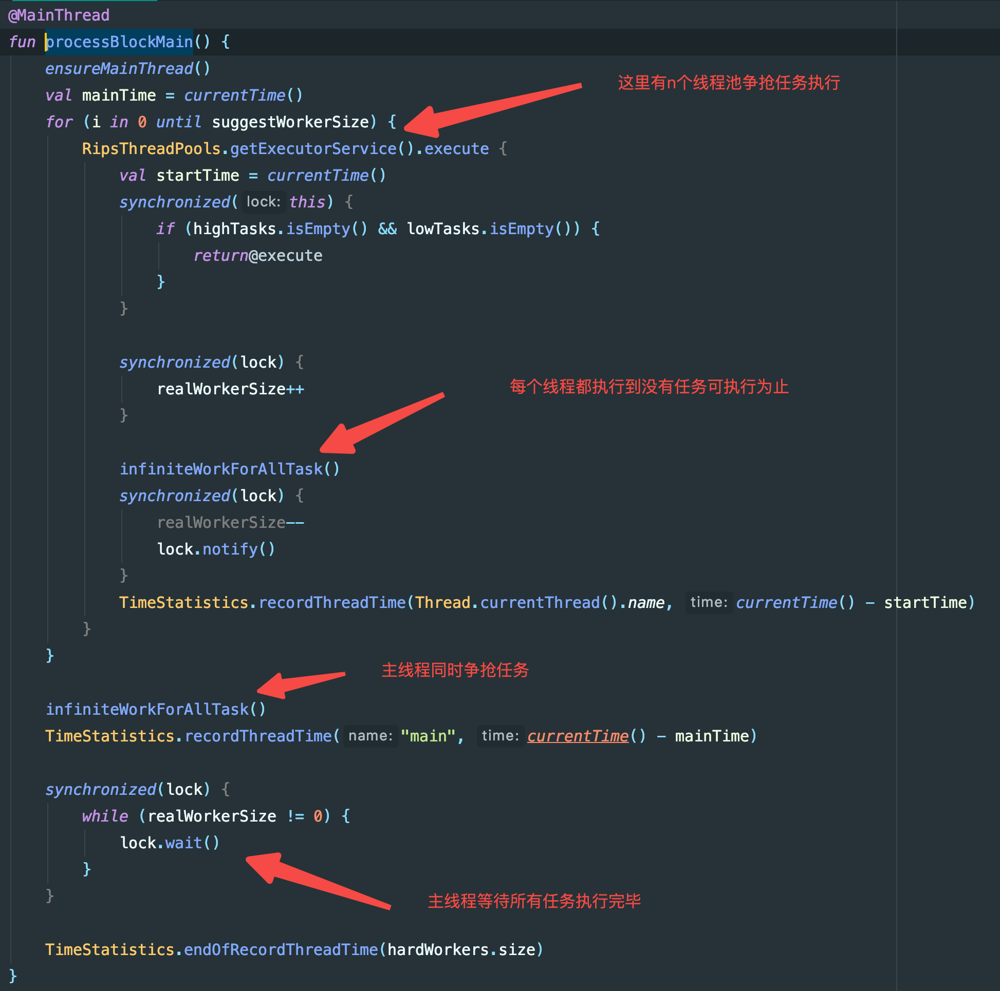

<!-- 图片说明：代码片段，processBlockMain 函数：调用 ensureMainThread()，获取 mainTime；for 循环 0..suggestWorkerSize 从 RipsThreadPools 获取 ExecutorService 提交任务（任务内 synchronized 检查 highTasks 和 lowTasks 是否为空，否则递增 realWorkerSize，调用 infiniteWorkForAllTask()，递减 realWorkerSize 并 notify）；主线程也调用 infiniteWorkForAllTask()；记录主线程时间；synchronized 中 while(realWorkerSize \> 0) lock.wait()。标注：n 个线程池争抢任务执行；每个线程都执行到没有任务可执行为止；主线程同时争抢任务；主线程等待所有任务执行完毕。 -->

此时内存中的布局大概是这个样子

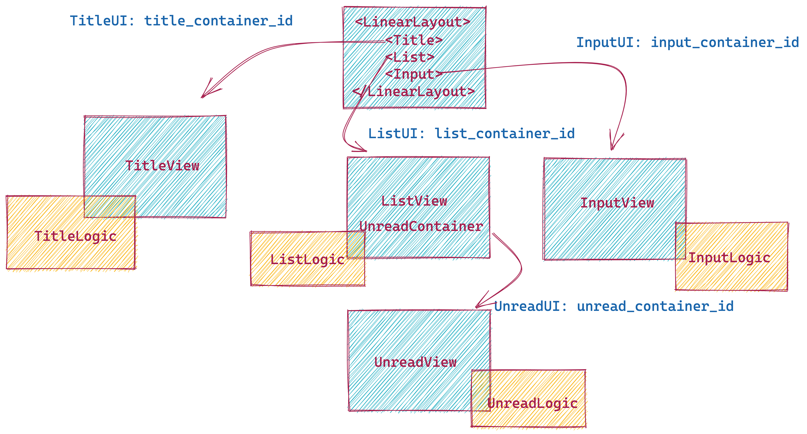

<!-- 图片说明：UI 树结构，\<LinearLayout\> 中 \<Title\>、\<List\>、\<Input\> 分别绑定到 TitleView+TitleLogic、ListView+ListLogic（含 UnreadContainer，进一步关联 UnreadView+UnreadLogic）、InputView+InputLogic。 -->

### 3.5 第三阶段：组件发布

当我们创建好了view实例和logic实例后，需要回调组件的onViewCreated方法，来设置数据到view上，这样首帧才能展示出我们想要的东西

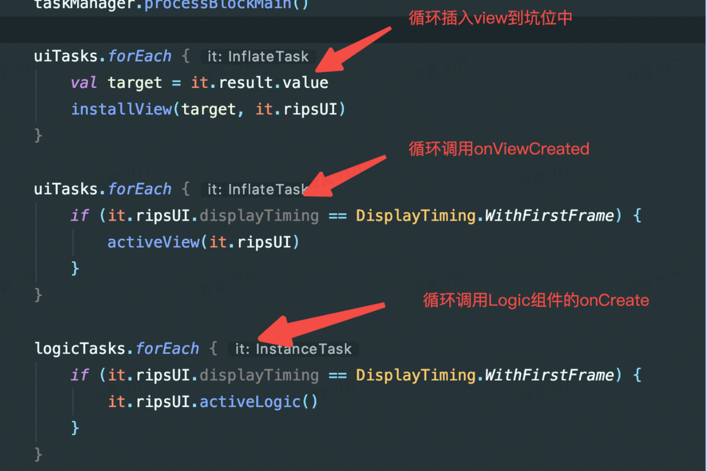

<!-- 图片说明：代码片段，三个循环：1) uiTasks.forEach { val target = it.result.value; installView(target, it.ripsUI) }（循环插入 view 到坑位中）；2) uiTasks.forEach { if (it.ripsUI.displayTiming == DisplayTiming.WithFirstFrame) activeView(it.ripsUI) }（循环调用 onViewCreated）；3) logicTasks.forEach { if (it.ripsUI.displayTiming == DisplayTiming.WithFirstFrame) it.ripsUI.activeLogic() }（循环调用 Logic 组件的 onCreate）。 -->

rips引入了一个叫做首帧完整性的概念，可以看到这里也是做首帧控制的关键，可以看这个文档里面的视频[聊聊架构：用Rips重构IM](https://bytedance.feishu.cn/docx/doxcnXETK7BJibOPPRfPljLWYad) 简单说就是可以控制哪些组件是随首帧展示的，这个有三个时机，WithFirstFrame，AfterFirstFrame，Lazy。可以看到只有WithFirstFrame的组件才会调用onViewCreated和Logic组件的OnCreate，在onCreate去拿数据才会在首帧完整展示。因此其他组件在首帧前都只会展示view的【原始内容】并且无法响应点击事件

此时内存布局大概是这个样子

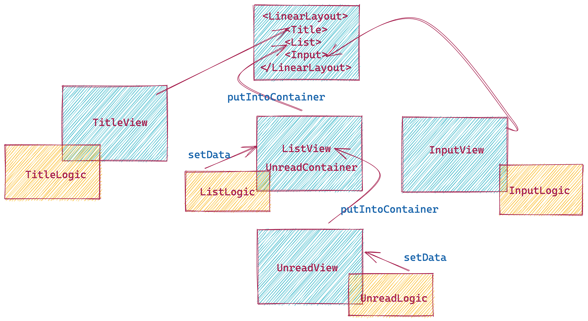

<!-- 图片说明：UI 树结构，\<LinearLayout\> 内 \<Title\>、\<List\>、\<Input\> 通过 putIntoContainer 关联到对应的 TitleView/InputView/ListView；ListLogic 通过 setData 设置到 ListView，UnreadLogic 通过 setData 设置到 UnreadView；UnreadContainer 关联到 UnreadView。 -->

### 3.6 设计总结

现在了解完细节，我们再往上一个层次来看看框架设计这个事。

首先，上层需要考虑使用者如何方便使用，低成本上手，这部分我们把xxUI这个开发者第一时间接触到的类的api设计得和Fragment一致，因此只要会用framgent就知道rips组件是怎么回事。同时我们设计了一套语义化的dsl，用attach和bind可以清晰地表达组件和容器之间的绑定关系，因此什么组件放哪里就一目了然

其次，dsl虽然简单，但是需要执行的逻辑可不简单，我们对耗时业务抽象出task，交由taskManager做调度处理，这个地方只有足够的抽象程度才能支持各类任务的调度及扩展，这一层和上层是逻辑隔离的，因此可以在这里配置不同的调度策略以完成性能调优，比如开几个线程？是否需要主线程顺序执行等等

最后，我们引入了一些首帧控制的调度策略，用不同的策略，整个组件生命周期的回调执行时机就不同，因此一些低优先级的组件往往被设置为lazy的，它的生命周期就会在较晚时候才会回调，首帧展示速度就会加快。但是作为开发者，业务逻辑是不用改变的，他们甚至都不感知

## 4 深入思考技术Tips

### 4.1 如何最大化并行操作？

仔细想想，并行阶段会不会存在badcase，如果主线程执行完毕却等待子线程很久岂不是会白白浪费很多时间？如下图，红框部分即为空等待，我们需要尽可能减少空等待以提高性能。

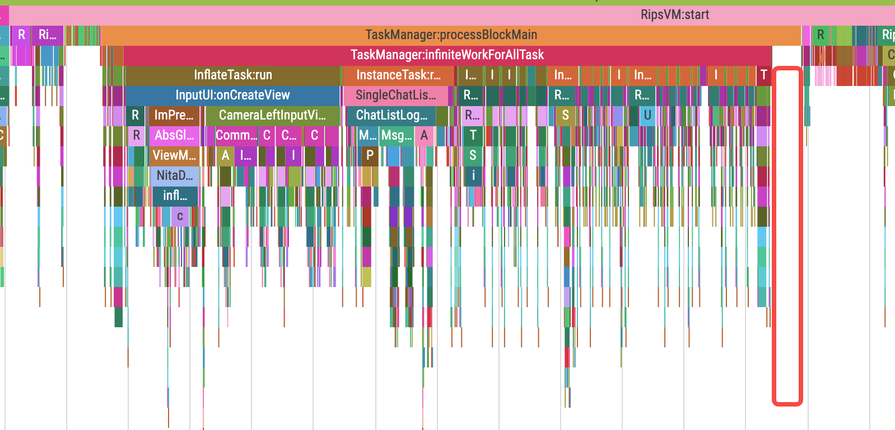

<!-- 图片说明：时间线 RipsVM:start → TaskManager:processBlockMain → infiniteWorkForAllTask，包含 InflateTask:run、InputUI:onCreateView、CameraLeftInputVi、ChatListLog 等任务条形，红框标记空等待区域。 -->

这就是LeetCode的一道考题，最优调度问题，我现在有n个任务分给m个工人做，如何保证所有任务可以在最短时间内完成（哈哈，字节面试算法果然有道理的）

ShowCase1: 如果有4个任务，2个线程则可以按如下分配，任务抢占，最长时间理论上可能是5+8 = 13ms

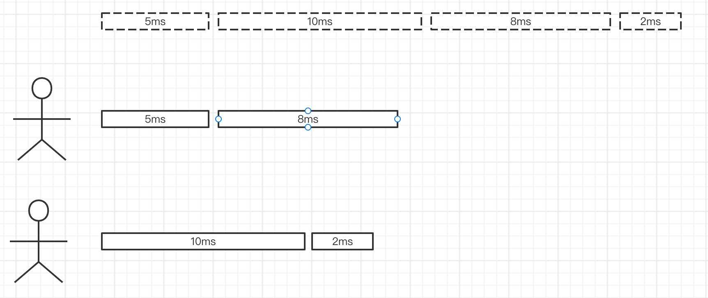

<!-- 图片说明：4 个任务（5ms、10ms、8ms、2ms）分配给 2 个工人，工人1 执行 5ms+8ms，工人2 执行 10ms+2ms。 -->

ShowCase2: 如果有3个线程，还是抢占式，则理论上总时长10ms，可以看到不同线程数对总时长有一定影响

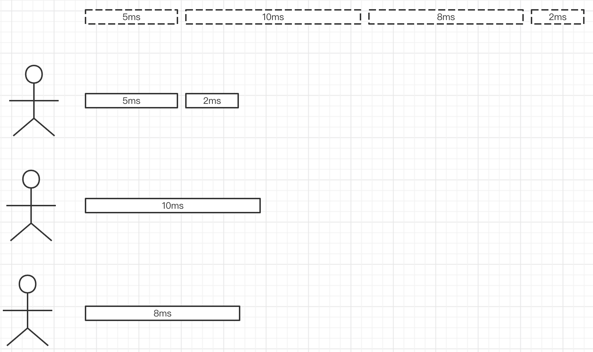

<!-- 图片说明：4 个任务分配给 3 个工人，工人1: 5ms+2ms，工人2: 10ms，工人3: 8ms。 -->

ShowCase3： 可能有badCase，即某个任务耗时特别长，那么时长可能会受最大耗时任务的影响，如下，抢占式任务总时长来到了32ms，可见【一个桶能装多少水取决于它最差的那块板】

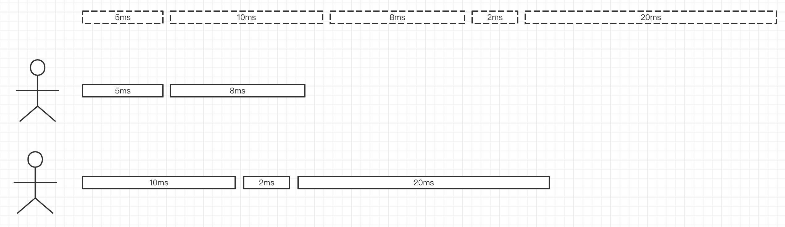

<!-- 图片说明：5 个任务（5ms、10ms、8ms、2ms、20ms）分配给 2 个工人，工人1: 5ms+8ms，工人2: 10ms+2ms+20ms。 -->

ShowCase4： final方案，排序+抢占， 即先做耗时较大的任务，再抢占执行，可见时间已经优化到25ms

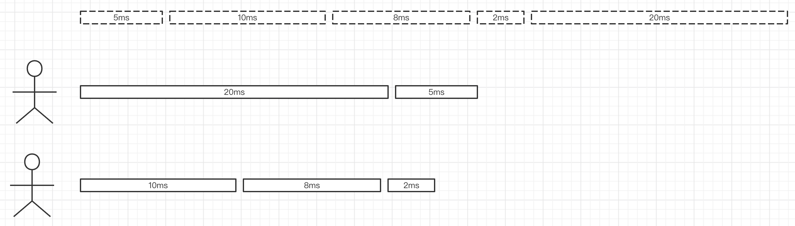

<!-- 图片说明：5 个任务排序后分配给 2 个工人，工人1: 20ms+5ms，工人2: 10ms+8ms+2ms。 -->

但是这个情况更复杂些，首先我们每个任务耗时多少是不清楚的，其次我们也不能开m个线程的线程池，因为可能增加整个app线程负担，最好是复用已有线程池，因此工人的数量也是不定的，而且我看LeetCode的普遍说的是回溯法，即循环+递归，这个分配任务的时间如果太长，就会出问题了，我们还阻塞着主线程呢。考虑到这些rips采用的是任务分级的方法，我把耗时较长的任务放到队列前端先执行，小的任务放到队尾，这样就能尽可能保证空等待时间减少

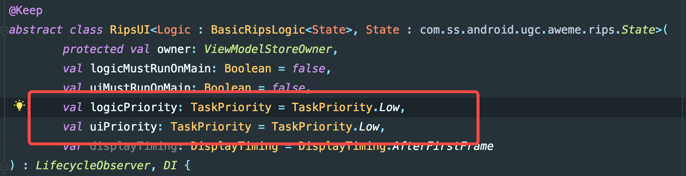

<!-- 图片说明：代码片段，abstract class RipsUI\<Logic\>，构造参数 owner: ViewModelStoreOwner、logicMustRunOnMain: Boolean = false、uiMustRunOnMain: Boolean = false、logicPriority: TaskPriority = TaskPriority.Low（红框）、uiPriority: TaskPriority = TaskPriority.Low（红框）、displayTiming: DisplayTiming = DisplayTiming.AfterFirstFrame。 -->

因此RipsUI上是可以指定一个优先级参数的，把耗时任务指定为high就好了。

### 4.2 并行加载View当真可行？

我们知道在子线程操作ui绘制是不可行的，但是在子线程inflate创建view却是可以的，这部分不要混淆。毕竟创建view只是从xml文件解析出view的各个节点并new一个view的实例就可以，因此从原理来说异步创建view完全可行，但是还是有些坑的。

问题1：比如抖音的nita框架，用application的context创建目标activity要使用的view，在深浅色模式下就会有bug。但是我们这里是用的activity作为context因此就规避了这个问题

问题2：还有一个问题是锁竞争， LayoutInflater在inflate的时候是有同步锁的！

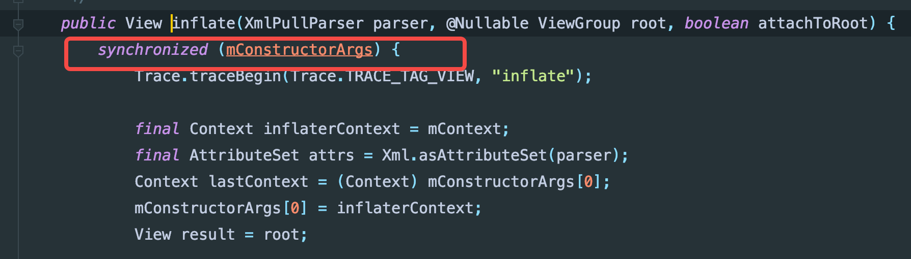

<!-- 图片说明：代码片段，public 方法 inflate(parser: XmlPullParser, root: ViewGroup?, attachToRoot: Boolean)，方法体首行 synchronized (mConstructorArgs) { ... } 红框标记，内部包括 Trace.traceBegin、final Context inflaterContext = mContext、AttributeSet attrs = Xml.asAttributeSet(parser) 等。 -->

因此如果各个线程都使用LayoutInflater.from(context)来创建view时就会用到同一个LayoutInflater实例

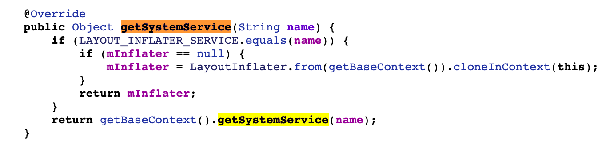

<!-- 图片说明：代码片段，重写 getSystemService(name: String)：若 name == LAYOUT_INFLATER_SERVICE，且 mInflater == null，则 mInflater = LayoutInflater.from(getBaseContext()).cloneInContext(this)，返回 mInflater；否则返回 getBaseContext().getSystemService(name)。 -->

因此解决方案也比较明确了，不同线程使用不同的layoutInflater即可。调用cloneInContext就能使用不同实例LayoutInflater.from(context).cloneInContext(newCtx)，具体实现可以看到就是new一个PhoneLayoutInflater

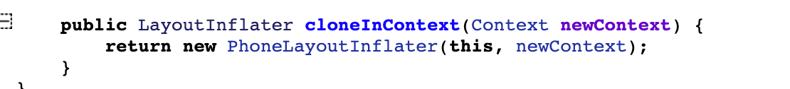

<!-- 图片说明：代码片段，public LayoutInflater cloneInContext(Context newContext) { return new PhoneLayoutInflater(this, newContext); }。 -->

问题3： AssertManager还存在锁竞争， 可以看到在Resource层面还存在锁，这个地方将会大大降低并行inflate的效率，线程的状态很多处于runnable而不是running

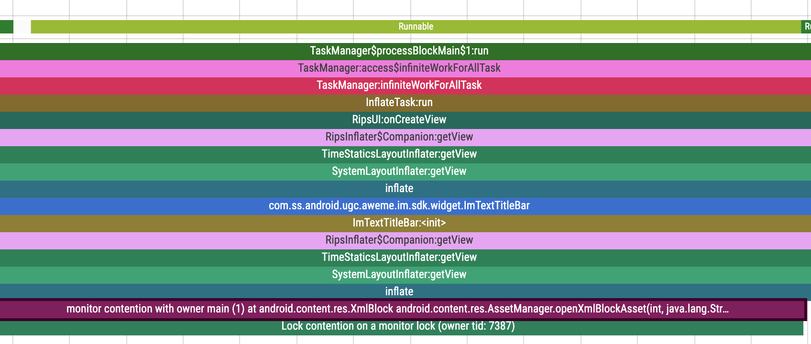

<!-- 图片说明：调用栈 Runnable → TaskManager$processBlockMain$1:run → access$infiniteWorkForAllTask → infiniteWorkForAllTask → InflateTask:run → RipsUI:onCreateView → RipsInflater$Companion:getView → TimeStaticsLayoutInflater:getView → SystemLayoutInflater:getView → inflate → ImTextTitleBar:\<init\> → ...，最下方为 monitor contention with owner main(1) at android.content.res.XmlBlock 和 AssetManager.openXmlBlockAsset，Lock contention on a monitor lock (owner tid: 7387)。 -->

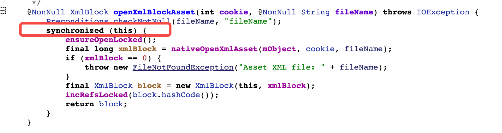

<!-- 图片说明：代码片段，openXmlBlockAsset(cookie: int, fileName: String)：Preconditions.checkNotNull(fileName)；synchronized (this)（红框）{ ensureOpenLocked(); long xmlBlock = nativeOpenXmlAsset(...); if (xmlBlock == 0) throw FileNotFoundException; XmlBlock block = new XmlBlock(this, xmlBlock); incRefsLocked(block.hashCode()); return block; }。 -->

这里采用了构造不同的AssetsManager实例的方案去避免锁竞争

简单来说我们需要使用新的context，而不是用原来的Activity作为context去加载资源，就可以使用到不同AssetsManager实例，Configuration里面有assetsSeq字段，把它反射修改后作为参数，通过context.createConfigurationContext就可以创建出一个ContextImpl实例。注意这个和用application作为context创建view是有区别的，原因在于下面的方案是【从Activity copy 出了一份configuration】，因此深浅色模式，density什么的配置都不会受影响。

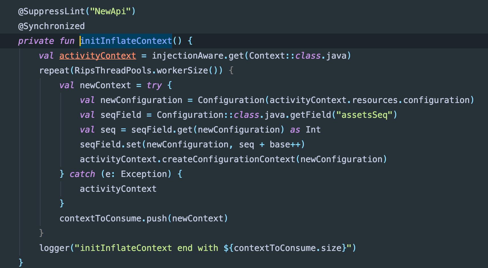

<!-- 图片说明：代码片段，@SuppressLint("NewApi") @Synchronized private fun initInflateContext()：activityContext = injectionAware.get(Context::class.java)；repeat(RipsThreadPools.workerSize()) { val newContext = try { val newConfiguration = Configuration(activityContext.resources.configuration); val field = Configuration::class.java.getDeclaredField("assetsSeq"); val seq = field.get(newConfiguration) as Int; field.set(newConfiguration, seq + base++); activityContext.createConfigurationContext(newConfiguration) } catch (e: Exception) { activityContext }; contextToConsume.push(newContext) }；末尾打印 "initInflateContext end with ${contextToConsume.size}"。 -->

这里还有个问题，如果view的context是ContextImpl，那么后续一些判断可能会出问题，比如有人会把context强转为activity，因此最后还需要把view的context做一次替换，递归操作view即可

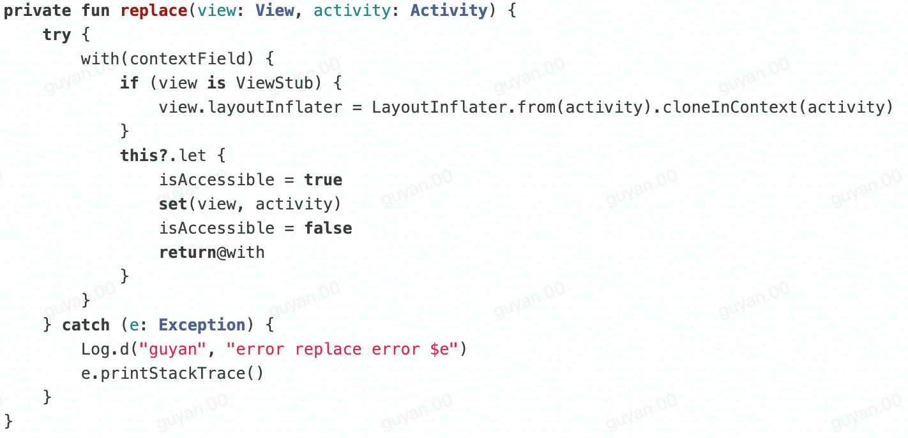

<!-- 图片说明：代码片段，private fun replace(view: View, activity: Activity) { try { with(contextField) { if (view is ViewStub) { view.layoutInflater = LayoutInflater.from(activity).cloneInContext(activity); return } this?.let { it.isAccessible = true; it.set(view, activity); it.isAccessible = false; return } } } catch (e: Exception) { Log.d("guyan", "error replace error $e"); e.printStackTrace() } }。 -->

### 4.3 组件之间交互是如何实现的？

rips采用一种ServiceLocator的方法来实现DI，任意组件可以向外暴露接口（如下InputApi），要暴露的api只需要实现ExposeApi这个标记接口即可。任意组件可以通过by inject获取其他接口，可以通过find()函数获取activity/fragment级别的全局变量。以此来完成组件间的通信

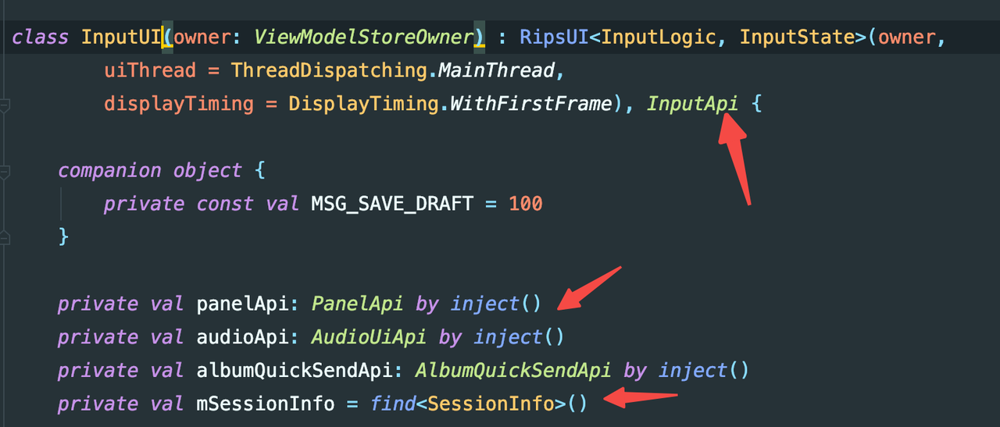

<!-- 图片说明：代码片段，class InputUI(owner: ViewModelStoreOwner, uiThread = ThreadDispatching.MainThread, displayTiming = DisplayTiming.WithFirstFrame) : RipsUI\<InputLogic, InputState\>(...), InputApi（红箭头标注）；companion object { private const val MSG_SAVE_DRAFT = 100 }；private val panelApi: PanelApi by inject()（红箭头）、audioApi: AudioUiApi by inject()、albumQuickSendApi: AlbumQuickSendApi by inject()；private val mSessionInfo = find\<SessionInfo\>()（红箭头）。 -->

它的思想也很简单，在viewModel中放置一个map，以Class的type作为key，以具体实现接口对象作为value存放到该map中，不同地方只要能拿到该viewmodel即可获取想要的数据。可以看看工具线的[ObjectContainer Guideline //使用文档](https://bytedance.feishu.cn/wiki/wikcntkVseSoxuyPWdllaIq3j7b) 不过我们这里使用的是一个简化版

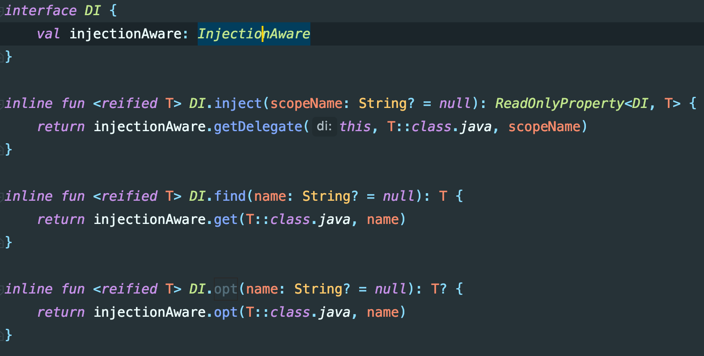

<!-- 图片说明：代码片段，interface DI { val injectionAware: InjectionAware }；inline fun \<reified T\> DI.inject(scopeName: String? = null): ReadOnlyProperty\<DI, T\> = injectionAware.getDelegate(this, T::class.java, scopeName)；inline fun \<reified T\> DI.find(name: String? = null): T = injectionAware.get(T::class.java, name)；inline fun \<reified T\> DI.opt(name: String? = null): T? = injectionAware.opt(T::class.java, name)。 -->

可以看到inject和find都是从injectionAware中获取的数据，而Rips组件默认都是实现了DI接口的，因此在rips组件内都是可以直接访问任意的其他组件接口的。下面是injectionAware的实现，可以看到实际上数据都是存储在RipsContainer的，它的实现就是HashMap

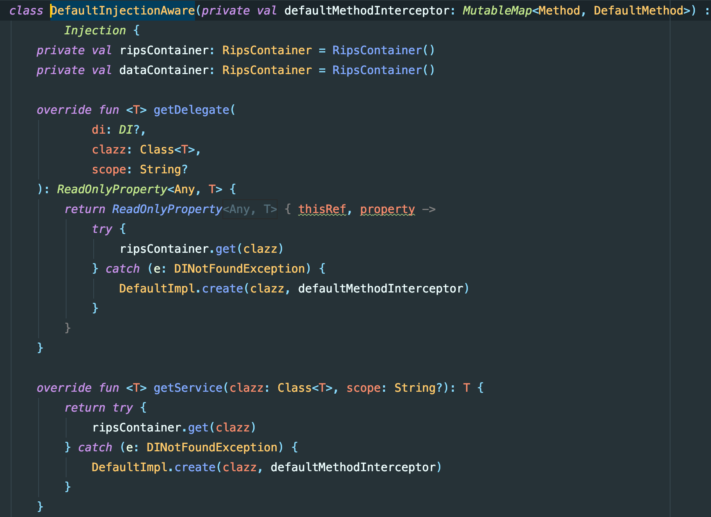

<!-- 图片说明：代码片段，class DefaultInjectionAware(private val defaultMethodInterceptor: MutableMap\<Method, DefaultMethod\>) : Injection { private val ripsContainer = RipsContainer(); private val dataContainer = RipsContainer(); override fun \<T\> getDelegate(di: DI?, clazz: Class\<T\>, scope: String?): ReadOnlyProperty\<Any, T\> = ReadOnlyProperty { thisRef, property -\> try { ripsContainer.get(clazz) } catch (e: DINotFoundException) { DefaultImpl.create(clazz, defaultMethodInterceptor) } }; override fun \<T\> getService(clazz: Class\<T\>, scope: String?): T = try { ripsContainer.get(clazz) } catch (e: DINotFoundException) { DefaultImpl.create(clazz, defaultMethodInterceptor) } }。 -->

### 4.4 其他

还有一些细节有空可以看看源码，比如ExposeApi的接口想提供自定义的默认实现应该怎么做？比如refined关键字的用法？比如为什么框架可以为你的UI创建一个关联的logic，却不用手动提供实现等等有意思的技术细节可以有空研究下~
